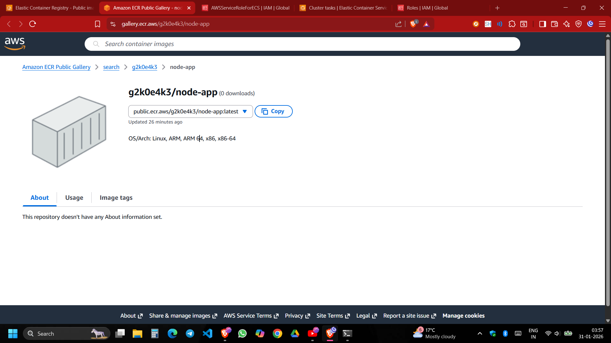
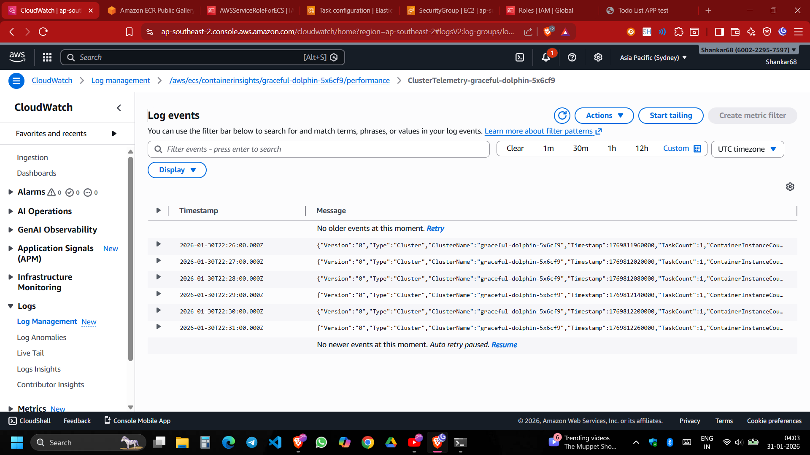

# AWS Cloud Deployment: EC2, ECR, ECS, and CloudWatch

This project demonstrates a complete workflow for deploying a containerized application on Amazon Web Services (AWS) using Elastic Container Service (ECS). It covers the end-to-end process from local development to production deployment and monitoring.

## 🏗️ Architecture Overview

The architecture utilizes the following AWS services:

*   **Amazon ECR (Elastic Container Registry):** Used to store and manage the Docker container images.
*   **Amazon ECS (Elastic Container Service):** Orchestrates the deployment of the application containers.
*   **Amazon EC2 (Elastic Compute Cloud):** Provides the virtual computing environment (instances) where the containers act.
*   **Amazon CloudWatch:** Monitors the application performance, logs, and metrics.

## 🚀 Deployment Workflow

The following steps outline the deployment process captured in this repository:

### 1. Docker Image Management
First, a Docker repository is created in ECR to host the application image.
- **Repository Creation:**
  
- **Repository Details:**
  

### 2. Build and Push
The application is containerized locally, tagged, and pushed to the ECR repository using the AWS CLI and Docker commands.
- **Terminal Commands:**
  

### 3. ECS Configuration
An ECS Task Definition is created to specify how the Docker container should run (memory, CPU, image URI, ports).
- **Task Definition:**
  
- **Container Settings:**
  

### 4. Cluster Setup & Deployment
An ECS Cluster is defined to group the services. The application is then deployed as a Service to ensure the desired number of tasks are always running.
- **Cluster Creation:**
  
- **Service Config:**
  
- **Deployment Status:**
  

### 5. Monitoring & cleanup
Once deployed, the application is accessible, and its performance can be tracked.
- **Live Application:**
  
- **Monitoring:** CloudWatch provides insights into CPU and memory utilization.
  

## 📋 Prerequisites
- AWS Account with appropriate permissions (ECS, ECR, EC2, CloudWatch).
- AWS CLI configured locally.
- Docker installed and running.
